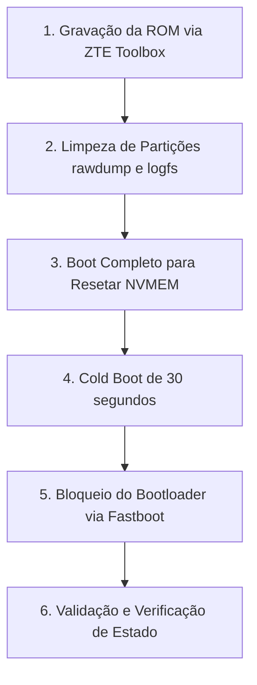

# Guia de Restauração de Fábrica e Bloqueio Seguro (ZTE Toolbox)

Este guia descreve o procedimento para retornar o RedMagic 11 Pro (NX809J) ao estado de fábrica original utilizando a ferramenta **ZTE Toolbox** (via modo EDL/9008), limpando todos os vestígios de desenvolvimento, dumps de RAM, logs de pânico e restaurando o status de bloqueio de bootloader original de forma segura.

---

## Fluxo do Procedimento



---

## 1. Restauração da Firmware via ZTE Toolbox

Como você está utilizando a **ZTE Toolbox** para restaurar a ROM, ela se encarregará de reinstalar as partições do sistema oficial com suas respectivas assinaturas originais.

1. Coloque o smartphone no modo **EDL (Qualcomm QDLoader 9008)**.
2. Na interface da **ZTE Toolbox**, selecione o pacote de firmware stock oficial correspondente ao seu dispositivo.
3. Inicie o processo de gravação e aguarde a finalização com sucesso.
4. **IMPORTANTE:** Não tente forçar o bloqueio de bootloader direto pela ferramenta durante a gravação para evitar riscos de incompatibilidade ou falhas de boot. Deixe a ferramenta apenas gravar o sistema original.

---

## 2. Limpeza Física das Partições de Dumps e Logs (Modo Fastboot)

Mesmo gravando a ROM original, partições secundárias de logs e dados de falha (`rawdump`) não costumam ser limpas automaticamente pelas ferramentas padrão. Para limpá-las manualmente:

1. Com o término da gravação da firmware, coloque o aparelho em modo **Fastboot** (segurando **Power + Volume Down**).
2. Conecte-o ao PC via USB.
3. No terminal do computador, execute os comandos de limpeza para zerar as partições de dumps físicos da RAM e logs de travamento de hardware:

```bash
# Apaga dumps de RAM do SoC gravados fisicamente
fastboot erase rawdump
fastboot erase rawdump_a
fastboot erase rawdump_b

# Apaga logs de erro armazenados na flash
fastboot erase logfs
```

---

## 3. Primeiro Boot Normal (Limpeza da Telemetria ZTE na NVRAM)

A ZTE utiliza registradores não voláteis (`NVMEM`) controlados pelo firmware do processador (Qualcomm SCM) para gravar mensagens sobre o último Kernel Panic ocorrido (através do driver `zte_reboot_ext.c`).

1. No terminal do computador, execute:
   ```bash
   fastboot reboot
   ```
2. Deixe o celular iniciar normalmente até carregar a tela de configuração inicial do Android.
3. **O que ocorre no hardware:** Durante esse primeiro boot de sucesso no kernel stock oficial, o driver de telemetria é inicializado com um buffer limpo e grava `0` (vazio) por cima do registro do antigo travamento, apagando permanentemente a telemetria gravada de falhas anteriores.

---

## 4. Limpeza da RAM Física (Cold Boot)

Para garantir que nenhum dado residual da execução anterior continue retido nas células de memória RAM física do aparelho:

1. Desligue o celular por completo.
2. Desconecte o cabo USB e qualquer fonte de alimentação.
3. Mantenha o aparelho desligado por no mínimo **30 segundos** (tempo suficiente para que os capacitores da placa-mãe e da RAM descarreguem completamente, limpando toda a memória física residual).

---

## 5. Bloqueio Seguro do Bootloader

Agora que todas as assinaturas estão no padrão stock oficial e os rastros foram apagados, o bloqueio do bootloader pode ser feito com segurança absoluta:

1. Ligue o aparelho em modo **Fastboot** (segure **Power + Volume Down**).
2. No computador, digite o comando:
   ```bash
   fastboot flashing lock
   ```
3. Na tela do celular, utilize as teclas de volume para selecionar a opção **"LOCK THE BOOTLOADER"** (ou "Bloquear o Bootloader") e confirme pressionando o botão **Power**.
4. O celular reiniciará automaticamente e realizará o processo final de redefinição de fábrica (`Wipe Data`).

---

## 6. Verificação de Sucesso

Uma vez que o dispositivo ligar, você poderá comprovar a restauração completa verificando:

* **Tela de Inicialização:** A mensagem laranja com o aviso de desbloqueio ("Your device software cannot be checked...") não será exibida, indo direto para a tela limpa de carregamento original do RedMagic.
* **Play Integrity / SafetyNet:** Os testes passarão de forma totalmente nativa (incluindo o nível de integridade de hardware), uma vez que o bootloader retornou ao estado `LOCKED` original no chip de segurança do processador.
* **Inexistência de Rastros:** Como os processadores Qualcomm não utilizam contadores de fusíveis irreversíveis de unlock (como o Knox da Samsung), o dispositivo volta a ser considerado inteiramente original e de fábrica.
