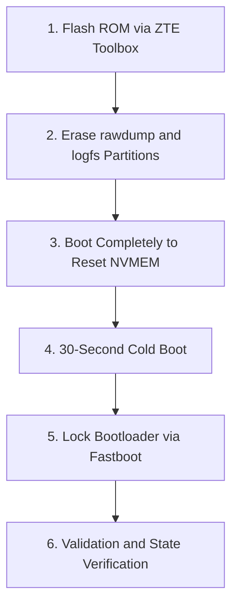

# Factory Restoration and Secure Locking Guide (ZTE Toolbox)

This guide describes the procedure to return the RedMagic 11 Pro (NX809J) to its original factory stock state using the **ZTE Toolbox** (via EDL/9008 mode), wiping all remnants of custom development, RAM dumps, panic logs, and securely restoring the original bootloader lock state.

---

## Procedure Flow



---

## 1. Firmware Restoration via ZTE Toolbox

Since you are using the **ZTE Toolbox** to restore the ROM, it will flash the official system partitions with their respective original signatures.

1. Put the smartphone into **EDL (Qualcomm QDLoader 9008)** mode.
2. In the **ZTE Toolbox** interface, select the official stock firmware package matching your device.
3. Start the flashing process and wait for it to complete successfully.
4. **IMPORTANT:** Do not attempt to force lock the bootloader directly through the tool during flashing to avoid incompatibility issues or boot failure. Let the tool only flash the original system.

---

## 2. Physical Cleaning of Dumps and Logs Partitions (Fastboot Mode)

Even when flashing the original ROM, secondary partitions containing logs and crash data (`rawdump`) are usually not cleared automatically by standard flashing tools. To clear them manually:

1. Once the firmware flashing is complete, put the device into **Fastboot** mode (by holding **Power + Volume Down**).
2. Connect it to the PC via USB.
3. In your computer's terminal, run the following erase commands to zero out the physical RAM dump partitions and hardware crash logs:

```bash
# Erase SoC RAM dumps physically recorded in storage
fastboot erase rawdump
fastboot erase rawdump_a
fastboot erase rawdump_b

# Erase crash logs stored in flash
fastboot erase logfs
```

---

## 3. First Normal Boot (Wiping ZTE Telemetry in NVRAM)

ZTE uses non-volatile register cells (`NVMEM`) managed by the processor firmware (Qualcomm SCM) to record details about the last occurred Kernel Panic (via the driver `zte_reboot_ext.c`).

1. In your computer's terminal, execute:
   ```bash
   fastboot reboot
   ```
2. Let the phone boot up normally until it reaches the Android setup wizard screen.
3. **What happens in hardware:** During this first successful boot with the official stock kernel, the telemetry driver is initialized with an empty buffer and writes `0` (null) over the previous panic records, permanently erasing any old crash telemetry.

---

## 4. Physical RAM Erasure (Cold Boot)

To ensure that no residual data from custom runs remains in the physical RAM cells:

1. Turn off the phone completely.
2. Disconnect the USB cable and any power source.
3. Keep the device powered off for at least **30 seconds** (this ensures the motherboard and RAM capacitors discharge completely, clearing all volatile residual memory).

---

## 5. Secure Bootloader Locking

Now that all partitions have valid original stock signatures and logs have been wiped, it is safe to lock the bootloader:

1. Turn on the device in **Fastboot** mode (hold **Power + Volume Down**).
2. In your computer's terminal, run:
   ```bash
   fastboot flashing lock
   ```
3. On the phone's screen, use the volume keys to select **"LOCK THE BOOTLOADER"** and confirm by pressing the **Power** button.
4. The phone will automatically reboot and perform the final factory data reset (`Wipe Data`).

---

## 6. Verification of Success

Once the device boots up, you can verify a clean state:

* **Boot Screen:** The orange warning message indicating an unlocked bootloader ("Your device software cannot be checked...") will no longer appear, and the phone will show the stock boot animation directly.
* **Play Integrity / SafetyNet:** Integrity tests will pass natively (including hardware-backed integrity) since the bootloader status is reported as `LOCKED` in the processor's secure enclave.
* **No Remaining Traces:** Unlike Samsung devices (which have the Knox eFuse), Qualcomm platforms do not use permanent physical fuses to mark bootloader unlocks. Locking it returns the device to a fully clean, factory-certified state.
